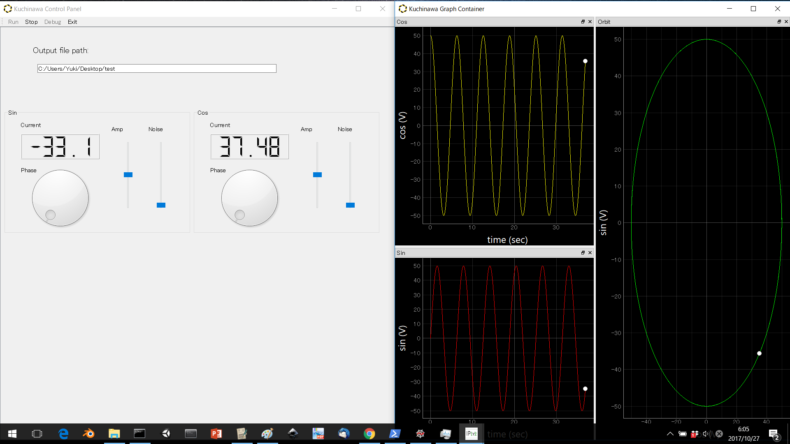
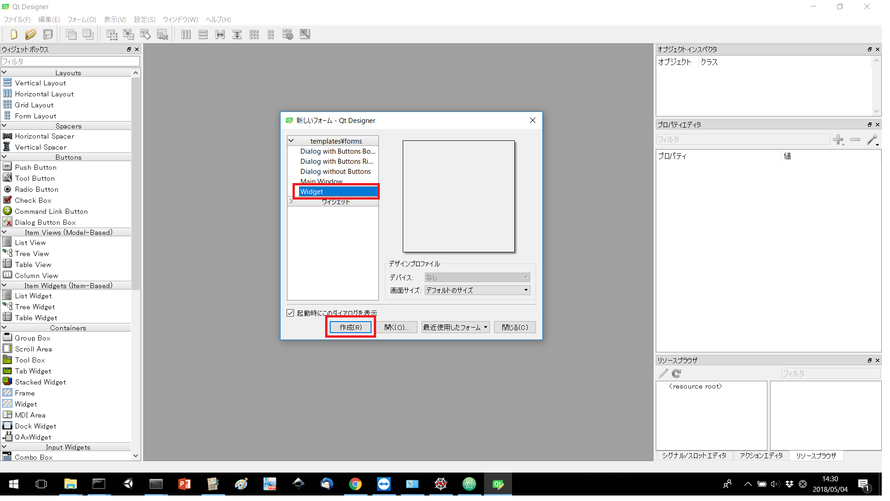
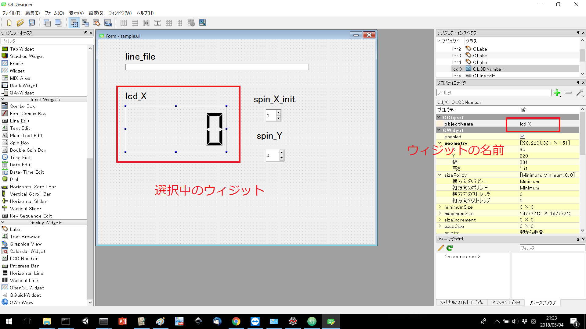
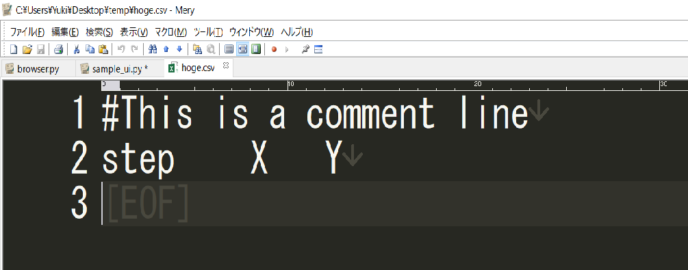
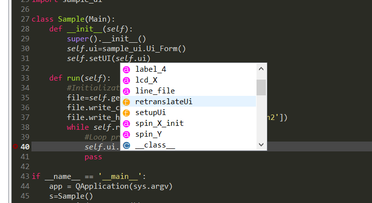
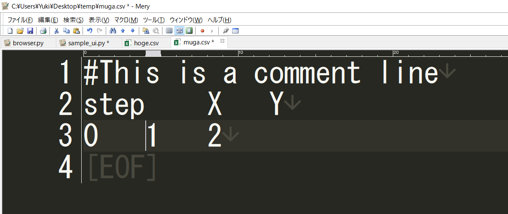
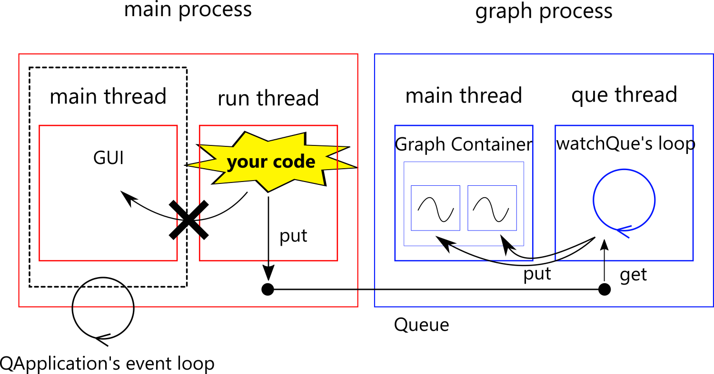

# Kuchinawa　朽縄　[English page is here](./README_ENG.md)
Kuchinawaは物性研究を行う実験系研究室の大学院生によって作られたPythonパッケージです。測定系制御のためのプログラムを簡単かつ効率的に作成できるライセンスフリー、オープンソースの開発環境を構築することを目標としています。

## 0. 特徴
### 0.0 機能
[使い方](#usage) の項で詳しく述べますが、Kuchinawaはユーザに以下の機能を提供します。これらの機能を利用することで、ユーザはGUIやグラフを生成するための煩雑なコードを書く事無く、直ちに実際の測定系制御のためのコーディングを行うことができます。
 - ドラッグアンドドロップ等の直感的な操作によるGUI作成機能
 - GUIから入力した値を用いてプログラムを動的に制御する機能
 - 測定系から取得した値をGUI上に表示する機能
 - リアルタイムの高速グラフ描画機能
 - csv形式のファイルへの出力機能

### 0.1 ライセンス
KuchinawaはMITライセンスで公開されているため、Kuchinawaのコード自体についてはライセンスの範囲内であれば自由に利用することができます。しかしKuchinawaは単体では動かず、以下に示すパッケージに（大いに）依存しています。再配布等を考える際にはこれら依存パッケージ内部のコードについては、当然ですがそれぞれのパッケージ開発者が定めているライセンスが適用されるということに注意して下さい。ユーザとしてKuchinawaを利用するだけであればライセンスの事はあまり気にする必要はありません。

| パッケージ名 | 機能 | ライセンス |
|-----------|------------|---|
| PyQt5 | GUI | GPL　|
| pyqtgraph   | グラフ | MIT |
| numpy   | 行列演算  | BSD |
| pandas   | 統計処理  | BSD |

## 1. インストール方法
Windows環境でAnacondaを使っている場合：
```
conda install -c threemeninaboat3247 kuchinawa
```
その他の場合（Windows, Linux, macOS）
```
pip install kuchinawa
```
## 2. サンプルプログラム
### 2.0 実行方法
Kuchinawaにはサンプルプログラムが付属しており、Pythonインタプリタ上で以下のコードを実行することで起動することができます。
```python
import kuchinawa
kuchinawa.run_sample()
```


上手くインストールができていれば上の図のように二つのウィンドウが現れます。左側のウィンドウの上部のツールバーの'run'というボタンを押すとファイルダイアログが開くので適当なファイル名を指定してください。

　左側のウィンドウの液晶表示部に数値が表示され、右側のウィンドウではグラフの描画が始まったと思います。このサンプルは時間tに対するSin(t), Cos(t)を計算して液晶、グラフに表示しながら指定されたファイルにcsv形式で出力するプログラムです。左側のウィンドウのスライダーやダイアルを動かしてみてください。Sin(t), Cos(t)の振幅や位相が変化し、ノイズが乗ることが分かると思います。このようにしてKuchinawaではGUIを介してプログラム内のパラメータを動的に制御することができます。

### 2.1 コード
以下のコードがこのサンプルプログラムのコードとなっています。
```python
# -*- coding: utf-8 -*-
# 標準モジュールのインポート
import sys,time
from datetime import datetime

# サードパーティーモジュールのインポート
import numpy as np
from PyQt5.QtWidgets import QApplication
from PyQt5.QtGui import QColor

# 内部的なインポート
from kuchinawa import Main,Graph
from kuchinawa.Examples import SinCos_ui

# 定数宣言
COLORS=[QColor(255,0,0),QColor(255,255,0),QColor(0,255,0)] #グラフの色
T='time'
Sin='sin'
Cos='cos'

class Sample(Main):
    def __init__(self):
        super().__init__()
        self.ui=SinCos_ui.Ui_Form() #QtDesignerで作成したGUIを取り込む
        self.setUI(self.ui) #GUIのセット

    def run(self):
        # 出力ファイルを生成
        file=self.getSaveFile()

        # GUI上のテキスト表示部にファイル名を表示し、ファイルにヘッダを書き込む
        self.call(self.ui.lineEdit.setText,(file.path,))
        file.write_header([T,Sin,Cos])

        # グラフを生成（引数として軸ラベルや色、タイトルを渡す）
        g_sin=self.addGraph(Graph.ScatterAll,(T,'sec',Sin,'V'),{'color':COLORS[0]},'Sin')
        g_cos=self.addGraph(Graph.ScatterAll,(T,'sec',Cos,'V'),{'color':COLORS[1]},'Cos')
        g_orbit=self.addGraph(Graph.ScatterAll,(Cos,'V',Sin,'V'),{'color':COLORS[2]},'Orbit')

        # 時間の原点を取得
        timeOrigin=datetime.now()

        # ループ処理に入る。GUI上のツールバーにあるstopボタンを押すとself.runningというフラグがFalseになるのでループから抜けてプログラムが終了する
        while self.running==True:
            # 時間原点からの経過時間を秒単位で取得
            t=(datetime.now()-timeOrigin).total_seconds()

            #振幅、位相、ノイズをユーザインタフェース上のウィジットから取得して時間に対するsin,cosを計算する
            sin=self.call(self.ui.amp_sin.value)*np.sin(t+np.pi*self.call(self.ui.dial_sin.value)/180)+\
                self.call(self.ui.noise_sin.value)*np.random.rand() #
            cos=self.call(self.ui.amp_cos.value)*np.cos(t+np.pi*self.call(self.ui.dial_cos.value)/180)+\
                self.call(self.ui.noise_cos.value)*np.random.rand()

            # 計算したsin,cosの値をGUI上の液晶部に表示
            self.call(self.ui.lcdNumber_sin.display,(sin,))
            self.call(self.ui.lcdNumber_cos.display,(cos,))

            # グラフに出力
            g_sin.put({'x':t,'y':sin})
            g_cos.put({'x':t,'y':cos})
            g_orbit.put({'x':cos,'y':sin})

            # ファイルに出力
            data={T:t,Sin:sin,Cos:cos}
            file.write_data(data)

            # 10ms待つ
            time.sleep(0.01)

if __name__ == '__main__':
    app = QApplication(sys.argv)
    s=Sample()
    sys.exit(app.exec_())            
```

## 3. 使い方 <div id="usage"></div>
Kuchinawaを用いたプログラムの開発過程は二つの段階から成ります。一つがQtDesigner
を用いたGUIの作成段階、そして残りが実際の処理のコーディングです。この項では実際のプログラムを作りながら一連の過程を説明します。作成するプログラムはある数XにGUI上から取得した値Yを加算するという処理をループするプログラムです。Xの初期値もGUI上から取得し、各ステップでのXの値をGUI上に表示しつつファイルとグラフにも出力することにします。また出力ファイルはファイルダイアログを出してユーザが指定できるようにし、指定したファイル名をGUI上に表示します。

### 3.0 作業ディレクトリ
以下で作るプログラムを保存及び実行するために何処でも構わないので作業ディレクトリを作成して下さい。以下の作業で作成したファイルは全てこのフォルダ内にあるという前提で話を進めます。

### 3.1 QtDesignerによるGUIの作成
QtDesignerはドラッグアンドドロップ等のグラフィカルな方法でGUIを作成することのできる便利なツールです。Anacondaに含まれているので、Anacondaをインストール済みの場合はコマンドプロンプト上で`designer`とタイプすれば起動します。そうで無い場合は個別にインストールして下さい。起動すると下の図のようなダイアログが出るので、Widgetを選択して作成ボタンを押して下さい。



QtDesignerでは左側のシェルフからボタンやスライダー等のウィジットをドラッグして中央のウィンドウ内にドロップすることでGUIを作成することができます。ここで重要なことは各ウィジットには一意の名前が存在するということです。この名前は後のコーディングの段階で各ウィジットにアクセスする時に必要になるので各自で分かるような系統的な名前をつけてやる必要があります。名前は配置したウィジットをクリックして選択した状態にすると右側のシェルフのObjectNameという項で確認及び変更が可能です。ここでは以下の図のようなGUIを作成したとします。



配置したウィジットの種類と付けた名前を以下のリストに示します。なお上の画像では分かり易くするために各ウィジットの上に付けた名前のラベル（Labelウィジット）を配置していますが、コーディング時には使わないので省略しても構いません。

| ウィジットの種類 | ウィジットの名前 |
|-----------|------------|
| Line Edit | line_file |
| LCD Number   | lcd_X  |
| Spin Box   | spin_X_init  |
| Spin Box   | spin_Y  |

GUIが完成したらメニューバーのファイルー＞保存を使って作業ディレクトリ内に`sample.ui`という名前で保存してください。

### 3.2 コンパイル
作成した`sample.ui`はXML形式のファイルです。我々はPythonでコーディングを行うのでこれをPythonモジュールに変換する必要があります。作業ディレクトリでコマンドプロンプトを立ち上げてPythonインタプリタを起動し、以下の文を実行して下さい。

```python
import kuchinawa
kuchinawa.compileUi('sample.ui')
```
作業ディレクトリ内に新たに`sample_ui.py`と`sample.py`というファイルができているはずです。`sample_ui.py`は`sample.ui`をPythonモジュールへと変換したものであり、`sample.py`はユーザが以降のコーディングの過程で実際の処理を記述していくための元となるファイルです。（`sample.py`中で`sample_ui.py`をimportしているので、この二つのファイルは同一ディレクトリにある必要があります。）

### 3.3 コーディング
コーディングの段階では行いたい作業を`sample.py`内の`Sample`クラスの`run`メソッド内に記述していきます。`Sample`クラスはKuchinawaの`kuchinawa.Thread.Main`クラスを継承しており、`Main`クラスでは測定系の制御プログラムを書くにあたって利用できるメソッドが幾つか用意されています。従ってユーザは`Main`クラスを継承したクラス（ここでは`Sample`クラスですが任意の名前で構いません。）を作って、その`run`メソッド内でそれらのメソッドを利用することで制御プログラムを簡単に作成することができます。コーディングにはAnacondaに含まれているSpyderというIDEを使うことをお勧めします。Spyderはメソッド名や変数名のリストを表示してくれるので効率的にコーディングを行うことが可能です。

`sample.py`をSpyderで開くと次のようになっています。import部分ではよく使われるであろうモジュール、GUIを操作するために必要なモジュール、Kuchinawa内部のモジュールがimportされています。また同一ディレクトリにあるはずの`sample_ui.py`もimportしてあり、これによってQtDesignerで作成してコンパイルしたGUIにアクセスできる仕組みとなっています。

```python
# -*- coding: utf-8 -*-

""" --- Description ---
    Module:
        Template.py
    Abstract:
        The template file for users.
    Modified:
        threemeninaboat3247 2018/04/30
    ---    End      ---
"""
# Standard library imports
import sys,time
from datetime import datetime

# Third party library imports
from PyQt5.QtWidgets import QApplication
from PyQt5.QtGui import QColor
import numpy as np

# Local imports
from kuchinawa.Thread import Main
from kuchinawa import Graph

import sample_ui

class Sample(Main):
    def __init__(self):
        super().__init__()
        self.ui=sample_ui.Ui_Form()
        self.setUI(self.ui)

    def run(self):
        #Initialization

        while self.running==True:
            #Loop process
            pass

        # Finalization

if __name__ == '__main__':
    app = QApplication(sys.argv)
    s=Sample()
    sys.exit(app.exec_())       
```

行いたい処理を記述する`Sample`クラスの`run`メソッドはコード内のコメントにあるように初期化処理、ループ処理、終了処理の三つの部分に分かれています。初期化の部分には例えばファイルやグラフの初期化等の処理を記述し、ループ処理の部分には測定系から値を取得してファイルやグラフに出力するといった処理を記述すると良いでしょう。終了処理ではファイルを閉じたり、測定系の電源を落とす等の処理を記述して下さい。
#### 3.3.0 初期化処理
今回は以下の４つの処理を行いたいと思います。
- ファイルの初期化（パスをファイルダイアログから取得し、ヘッダを出力する）
- ファイルパスをGUI上のline_fileに表示
- GUI上のspin_X_initからXの初期値を取得
- グラフの初期化（軸のラベルやタイトル、色を指定する）

##### ファイルの初期化 `self.getSaveFile`
ファイルダイアログを出してファイルパスを取得するためにKuchinawaでは`getSaveFile`というメソッドを用意しています。`getSaveFile`は`Sample`クラスのインスタンスメソッドなので、`run`メソッド内では`self.`の後にメソッド名を付けることで指定可能です。`getSaveFile`のDocStringは次のようになっています。引数としてcsvファイルの列間の区切り文字とコメント行の先頭文字を受け取り、ユーザがファイルダイアログで指定したファイルパスへのファイルインスタンスを返します。

```python
def getSaveFile(self,sep='\t',comment='#'):
    '''
    Open a file dialog and return a csv file instance holding the path appointed in the dialog.

    Parameters:
        sep: str
            the seperater between values in the csv file
        comment: str
            the header of comment lines
    Returns:
        File.File
    '''
```

ファイルインスタンスは`kuchinawa.File.File`クラスのインスタンスであり、次に示すようなメソッドを持ちます。

| メソッド名 | 引数 | 説明　|
|-----------|------------|---|
| close | 無し | ファイルを閉じる |
| save   | 無し   | 書き込み内容を外部プログラムからも確認できるようにセーブする  |
| write_comment   | 文字列  | 文字列をコメントとして書き込む  |
| write_header   | リスト  |  リストの順にヘッダ（列の名前）を書き込む |
| write_data   | 辞書型  | １行書き込む（辞書型のkeyと同名の列にvalueの値が書き込まれる |

よってファイルを作って、コメントとヘッダ行を書き込むというコードは以下のようになります。

```python
file=self.getSaveFile()
file.write_comment('This is a comment line')
file.write_header(['step','X','Y'])
```
出力結果は以下です。



##### GUI上への値の表示、及びGUI上からの値の取得 `self.call`
QtDesignerを使って作ったGUIは`self.ui`という名前で格納されており、Spyderでは以下のように`self.ui.`までタイプすると作ったウィジットが確認できます。



各ウィジットはそれぞれ任意の値を表示したり、現在の値を取得するといったメソッドを持っています。ここで使うウィジットとそのメソッドを列挙すると以下のようになります。

| ウィジットの種類 | メソッド名 | 引数 | 説明 |
|-----------|------------|---|---|
| Line Edit | setText | 文字列 | 文字列を表示する |
| LCD Number   | display  | float値 | float値を表示する |
| Spin Box   | value  | 無し | 現在値を取得する |

よってGUI上への値の表示やGUI上からの値の取得を行うにはこれらのメソッドを呼び出せば良い訳です。Kuchinawaではこの呼び出しのために`self.call`というメソッドを用意しています。何故通常の方法で呼び出していないかと言いますと、GUIオブジェクトが存在してイベントループが回っているスレッドと`run`メソッドが実行されているスレッドが異なるからです。（詳しくは[参考](#appendix)の項を参照して下さい。）

`self.call`のDocStringは以下のようになっています。
```python
def call(self,function,args=None,kwargs=None):
    '''
    Call a function in the thread in which the instance of this class exists.

    Paramters:
        function: function
            a function to call
        args: tuple
            positional arguments
        kwargs: dict
            keyward arguments

    Returns:
        object
            depends on the function
    '''
```

呼び出し時には引数として順に、メソッド、ポジショナル引数（タプル形式）、キーワード引数（辞書型形式）を渡して下さい。例えばLCD Numberの`display`メソッドは引数としてポジショナル引数を一つのみ持つので、`self.ui.lcd_X.display(100)`という呼び出しを行いたければ`run`メソッド中では`self.call(self.ui.lcd_X.display,(100,))`と呼び出して下さい。引数は無ければ省略可能で、メソッドの返り値が`self.call`の返り値として返されます。

これを使ってファイルパスをline_fileに表示し、spin_X_initからXの初期値を取得するというコードは以下のようになります。

```python
# file.pathにはファイルパスが文字列で入っている
self.call(self.ui.line_file.setText,(file.path,))
# 取得した値をxに代入
x=self.call(self.ui.spin_X_init.value)
```

##### グラフの初期化　`self.addGraph` <div id="addGraph"></div>
Kuchinawaではサードパーティー製モジュールの[pyqtgraph](http://www.pyqtgraph.org/documentation/)を用いてグラフ描画を行っています。現状では単純なX-Yプロットのグラフ(`kuchinawa.Graph.ScatterAll`)しかありませんが、ユーザは`kuchinawa.Graph.GraphBase`を継承したクラスを作ることで任意のグラフ描画を行うことができます。詳しくは[参考](#appendix)の項を参照して下さい。

グラフを生成するには`addGraph`というメソッドを使います。DocStringは以下です。

```python
def addGraph(self,graph,args=None,kwargs=None,name='Unnamed'):
    '''
    Add a graph to GraphContainer.

    Parameters:
        graph: class
            a subclass of Graph.GraphBase
        *args: tuple
            positional arguments to pass to __init__ of 'graph'
        **kwargs: dict
            keyword arguments to pass to __init__ of 'graph'
        name: string
            the window title of the graph
    Returns: Graph.GraphInterface
        the interface to plot data to the graph
    '''
```
引数のgraphは生成するグラフのクラス、args、kwargsはそれぞれクラスのコンストラクタに渡されるポジショナル引数（タプル形式）、キーワード引数（辞書型形式）です。グラフはサンプルプログラムの例のように一つのウィンドウ内のサブウィンドウとして埋め込まれるのですが、そのサブウィンドウのウィンドウタイトルがname引数で指定できます。よって`addGraph`に渡すべき引数はグラフのクラスによって異なりますが、`ScatterAll`クラスではコンストラクタに以下のような引数を渡すようになっています。

```python
class ScatterAll(GraphBase):
    '''
    Plot all data and highlight the latest point. Put a new data in a dict: {'x': x value,'y': y value}
    '''
    def __init__(self,xlabel,xunit,ylabel,yunit,color='w'):
        '''
        Parameters
            xlabel: str
                the x axis' label
            xunit: str
                the x axis' unit
            ylabel: str
                the y axis' label
            yunit: str
                the y axis's unit
            color: str / PyQt5.QtGui.QColor

        Returns
            None
        '''
```
引数は順に文字列でx軸ラベル、x軸単位、y軸ラベル、y軸単位、グラフの色となっています。グラフの色はは`PyQt5.QtGui.QColor`を使ってRGB形式でも指定できます。ここでは次のように指定します。

```python
# QColorはデフォルトでimport済み、addGraphの返り値をgraphに代入
graph=self.addGraph(Graph.ScatterAll,('Step','num','X','num'),{'color':QColor(255,0,0)})
```
`addGraph`の返り値は`kuchinawa.Graph.GraphInterface`というクラスのインスタンスです。このインスタンスは生成したグラフと紐づいており、後にグラフにデータを出力するために使うので変数に代入して保持しておく必要があります。

#### 3.3.1 ループ処理
ループ処理中で行う新たな処理として以下について説明します。
- グラフへのデータ出力
- ファイルへのデータ出力

##### グラフへのデータ出力 `kuchinawa.Graph.GraphInterface.put`
グラフの初期化の項で生成した`kuchinawa.Graph.ScatterAll`クラスではデータが辞書型で`{'x': x座標, 'y' : y座標}`の形で入力されることを前提に描画処理を行っています。生成したグラフにデータを出力するには`self.addGraph`の返り値として取得した`kuchinawa.Graph.GraphInterface`インスタンスの`put`メソッドを用います。例えば(x,y)座標が(1,2)というデータ点を出力するには以下のようにします。

```python
# graphはkuchinawa.Graph.GraphInterfaceのインスタンス
data={'x':1,'y':2}
graph.put(data)
```

##### ファイルへのデータ出力 `kuchinawa.File.File.write_data`
ファイルの初期化で生成したヘッダ行がstep, X, Yであるファイルに新たなデータ行を追加する方法は以下です。

```python
# fileはkuchinawa.File.Fileのインスタンスで列の名前がstep,X,Yとする
data={'step':0,'X':1,'Y':2}
file.write_data(data)
```
これによって次のようにデータ行が追加されます。


#### 3.3.2 終了処理
今回は実際に測定系を制御している訳では無いので、ファイルのクローズだけやっておきましょう。ファイルをクローズするとテキストエディタ等の外部プログラムでも内容が確認できます。
```python
file.close()
```

#### 　3.3.3 まとめ <div id="usage_end"></div>
これまでに見てきたメソッドを使って[3.3の冒頭](#usage)で述べた処理を行うコードを以下に示します。複数回現れる文字列は定数宣言を使って見やすくしています。

```python
# -*- coding: utf-8 -*-

""" --- Description ---
    Module:
        Template.py
    Abstract:
        The template file for users.
    Modified:
        threemeninaboat3247 2018/04/30
    ---    End      ---
"""
# Standard library imports
import sys,time
from datetime import datetime

# Third party library imports
from PyQt5.QtWidgets import QApplication
from PyQt5.QtGui import QColor
import numpy as np

# Local imports
from kuchinawa.Thread import Main
from kuchinawa import Graph

import sample_ui

STEP='Step'
X='X'
Y='Y'

class Sample(Main):
    def __init__(self):
        super().__init__()
        self.ui=sample_ui.Ui_Form()
        self.setUI(self.ui)

    def run(self):
        #Initialization
        # 標準出力にスタートメッセージを出す
        print('program started')

        # ファイルの初期化
        file=self.getSaveFile()
        file.write_comment('This is a comment line')
        file.write_header([STEP,X,Y])

        # GUI上へのファイルパスの表示、Xの初期値の取得
        self.call(self.ui.line_file.setText,(file.path,))
        x=self.call(self.ui.spin_X_init.value)

        # グラフの初期化
        graph=self.addGraph(Graph.ScatterAll,(STEP,'num',X,'num'),{'color':QColor(255,0,0)})

        # ステップ数を数える
        step=0
        while self.running==True:
            #Loop process
            # Yの値を取得
            y=self.call(self.ui.spin_Y.value)

            # XにYを加算
            x=x+y

            # グラフに出力
            g_data={'x':step,'y':x}
            graph.put(g_data)

            # ファイルに出力
            f_data={STEP:step,X:x,Y:y}
            file.write_data(f_data)

            # ステップ数をカウントアップ
            step=step+1

        #Finalization
        # ファイルを閉じる
        file.close()

        # 標準出力に終了メッセージを出す
        print('program finished')

if __name__ == '__main__':
    app = QApplication(sys.argv)
    s=Sample()
    sys.exit(app.exec_())       
```


### 3.4 実行方法
最後に上のコードを実行してみましょう。コマンドプロンプトで`python sample.py`として実行可能です。ウィンドウが立ち上がったらツールバーのRunボタンを押して下さい。ファイルダイアログが出たら適当なファイル名を指定して下さい。グラフの描画が始まり、Yの値をspin_Yで変えた時に反応があれば成功です。ツールバーのStopボタンを押すとループ処理から抜けて終了処理が実行されます。再びRunボタンを押すことで同じ処理を繰り返し実行することが可能です。プログラムを終了する場合はExitボタンを押して下さい。ウィンドウが二つとも閉じてプログラムが終了します。

## 4.　測定器との通信
実際に測定系を制御するプログラムを書くためには測定器との通信を行う必要が有ります。GPIB, RS232, USB, Ethernetを使った測定器との通信を行うには[pyvisa](https://pyvisa.readthedocs.io/en/stable/)というパッケージが利用できます。pyvisaを使った通信については日本語の情報も多いので詳細は省略します。

pyvisaは測定器によらない汎用的な通信を行うので、例えば測定器からクエリで取得した文字列を数値に変換する時には改行文字等を取り除く必要があるといった不便もあります。特定の測定器に対応するクラスを数多く提供しているパッケージとして[pymeasure](https://github.com/ralph-group/pymeasure)があります。もし自分が使う測定器のクラスが用意されている場合は利用してみると良いでしょう。

## 5. 最後に
最後まで読んで頂きありがとうございます。Kuchinawaはまだまだ未熟なパッケージであり、今後も開発を継続する予定です。ユーザからのフィードバックはパッケージの改善に繋がるだけでなく、我々のモチベーションを上げるためにも有用です。使ってみた結果改善して欲しい点や感想・質問等ありましたら、[こちら](https://github.com/threemeninaboat3247/kuchinawa/issues/1)から我々にメッセージを送って下さい。ただし主に土曜日、日曜日が開発者がKuchinawaに関する仕事をする曜日ですので、返信等が必要な場合は少し気長に待って下さい。


## 6. 参考 <div id="appendix"></div>
### 6.0 プログラム実行の仕組み <div id="mechanism"></div>
この項ではユーザがKuchinawaを使って書いたプログラムがどのように実行されて、GUIやグラフの描画が行われているのかを述べたいと思います。[使い方](#usage)の項で作成したプログラムを`python sample.py`で実行すると以下の図のような二つのプロセス（pythonにおける並列処理の単位）が生成されます。



それぞれのプロセスの中では複数のスレッドが並列に動いています。上の図の中でユーザが明示的に生成しているのはmain processのmain threadです。[3.3.3 まとめ](#usage_end)で示したコードの最後に以下のような部分があります。

```python
if __name__ == '__main__':
    app = QApplication(sys.argv)
    s=Sample()
    sys.exit(app.exec_())    
```
この部分で`QApplication`というGUIのイベントハンドラ（ボタンが押されたらそれを検知し、予め設定されている関数を呼び出す等の処理を行うオブジェクト）を起動し、ユーザが`run`メソッドを実装した`Sample`クラスのインスタンスを生成しています。

main processのrun threadはユーザがツールバー上のRunボタンを押すと生成され、`run`メソッド内に記述した処理が順に実行されます。このrun threadとmain threadが分かれているということが、`run`メソッド中でGUI上のウィジットのメソッドを呼び出す時に特殊な呼び出しを行っていた理由です。実際にはmain thread内のウィジットのメソッドを直接呼び出す事もできてしまうのですが、ウィジットはスレッドセーフ（複数のスレッドからアクセスされた時の動作が保証されている）オブジェクトではないのでこの方法は推奨されません。Kuchinawaではシグナルとスロットを用いたスレッドセーフな方法でウィジットのメソッド呼び出しを行っており、それが`self.call`です。

graph processはKuchinawaが陰に生成しているプロセスであり、このプロセスではグラフ描画を行っています。main processのrun thread中で`put`メソッドによって出力されたデータはQueueというプロセス間で共有可能なデータ構造にプッシュされgraph process内でポップされます。このポップの操作を行っているのがque threadであり、ポップされたデータは各グラフインスタンスが各自持っているQueueにプッシュされます。各グラフインスタンスは一定間隔毎に呼び出されるメソッドを持っていて、このメソッド内ではQueueからデータをポップして新たなデータ点として描画するという処理を行っています。二つのプロセスを用いている理由はPythonには備わっているGILという仕組みが存在しており、マルチスレッドを用いた実装だとグラフ描画に影響されてユーザが記述した処理の実行が遅くなる可能性があるからです。

### 6.1 独自のグラフクラスの実装
Kuchinawaには現状で単純なX-Yプロットのグラフしかありません。例えば複数のデータ系列の色を変えて凡例をつける等の独自のグラフ描画を行いたい場合は`kuchinawa.Graph.GraphBase`クラスを継承した独自クラスを作成し、[addGraph](#addGraph)メソッドの第一引数に渡して下さい。オーバーライドするべきメソッドはグラフの初期化を行う`__init__`と一定間隔毎に呼び出される`update`です。[プログラム実行の仕組み](#mechanism)の項で述べたように`run`メソッド内から`put`メソッドでグラフに対して出力されたデータは`kuchinawa.Graph.GraphBase`が持っているQueue（変数名は`que`なので`self.que`でアクセス可能）に溜まっていきます。`update`メソッド内では`self.que`からデータを取り出してグラフに描画するという処理を実装して下さい。実装には[pyqtgraph](http://www.pyqtgraph.org/documentation/)の知識が多少要求されますが、pyqtgraphの公式ドキュメントと以下の`kuchinawa.Graph.GraphBase`と`kuchinawa.Graph.ScatterAll`のクラス設計を見れば実装はそれ程難しくないでしょう。

猶今後の開発では使えるグラフの種類をもっと増やす予定です。

```python
import pyqtgraph as pg

class GraphBase(pg.PlotWidget):
    '''
    A Base class which can be added to GraphContainer
    '''
    GRAPH_RATE=100  #update rate (/millisecond)

    def __init__(self):
        super().__init__()

        self.que=Queue()

        self.timer=QTimer()
        self.timer.timeout.connect(self.update)

        self.plt=self.plotItem
        self.plt.showGrid(x=True,y=True)
        fontCss = {'font-family': "Segoe UI, メイリオ", 'font-size': '14pt', "color": 'white'}
        self.plt.getAxis('bottom').setLabel(**fontCss)
        self.plt.getAxis('left').setLabel(**fontCss)

    def getQue(self):
        return self.que

    @abstractmethod
    def update(self):
        '''Implementation of graph update'''
        raise NotImplementedError('This method must be implemented in a subclass.')

    def start(self):
        self.timer.start(self.GRAPH_RATE)
```

```python
class ScatterAll(GraphBase):
    '''
    Plot all data and highlight the latest point. Put a new data in a dict: {'x': x value,'y': y value}
    '''
    def __init__(self,xlabel,xunit,ylabel,yunit,color='w'):
        '''
        Parameters
            xlabel: str
                the x axis' label
            xunit: str
                the x axis' unit
            ylabel: str
                the y axis' label
            yunit: str
                the y axis's unit
            color: str / PyQt5.QtGui.QColor

        Returns
            None
        '''

        super().__init__()
        #Initialization of PlotItem
        self.xlabel=xlabel
        self.ylabel=ylabel

        self.x=[]
        self.y=[]

        self.point=None

        self.plt.setLabel('bottom',xlabel, units=xunit)
        self.plt.setLabel('left', ylabel, units=yunit)

        self.curve=self.plt.plot(self.x,self.y,pen=color)
        self.start()
        #set markers at latest values if data lenght is not zero.

    def update(self):
        '''
        Pop data from self.que and plot them to the graph assuming that the data are a dictionary like {'x': x value,'y': y value}.
        '''
        mylist=self.empty_que()
        if len(mylist)>0:
            xappended=[d['x'] for d in mylist]
            self.x=self.x+xappended
            self.x_last=xappended[-1]
            yappended=[d['y'] for d in mylist]
            self.y=self.y+yappended
            self.y_last=yappended[-1]

            if not self.point==None:
                self.plt.removeItem(self.point)

            self.curve.setData(self.x,self.y)
            self.point=self.plt.plot([self.x_last],[self.y_last],symbolBrush='w')

    def empty_que(self):
        '''Take out data from the que and return them in a list.'''
        mylist=[]
        while True:
            if not self.que.empty():
                v=self.que.get()
                mylist.append(v)
            else:
                break
        return mylist
```
